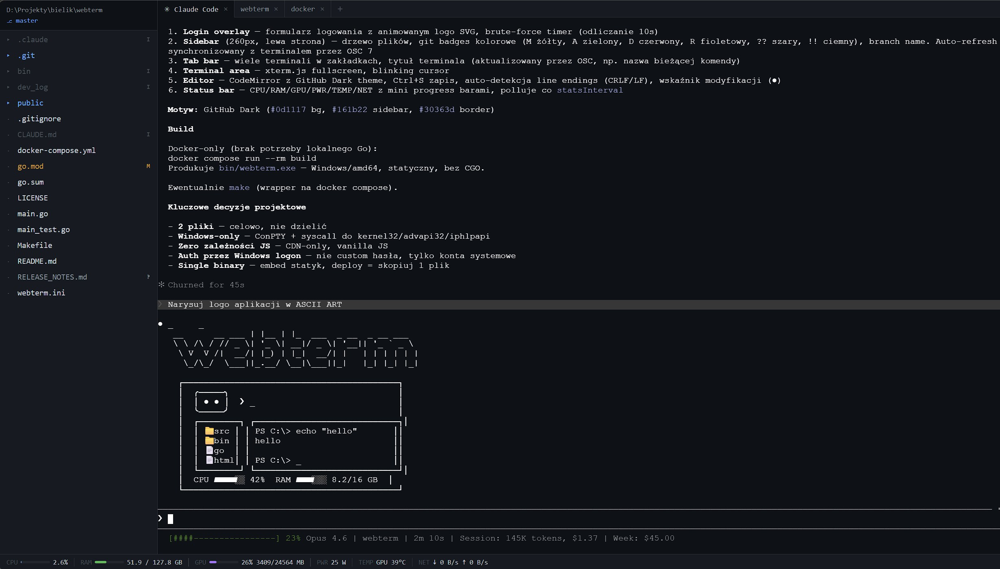

# webterm

Web-based terminal with a file explorer sidebar. Runs on Windows using ConPTY.

Single Go binary, zero dependencies — just run `webterm.exe` and open the browser.



## Features

- **Terminal** — full PTY terminal in the browser via WebSocket + [xterm.js](https://xtermjs.org/), multiple tabs with independent sessions, tab names auto-update to show the running command
- **File explorer** — sidebar with tree view (expand/collapse), git status badges (M/A/D/R/?), and current branch display
- **File editor** — click any file to open an in-browser editor with syntax highlighting (Python, Go, HTML, Markdown, JS/TS, CSS, YAML, SQL, and more via [CodeMirror](https://codemirror.net/5/)), save (Ctrl+S), unsaved change detection, and line ending preservation
- **Resource monitor** — status bar with CPU, RAM, GPU (NVIDIA), power draw, temperatures (CPU via WMI, GPU), and network throughput
- **Shell integration** — file explorer auto-syncs with terminal CWD via OSC 7 (PowerShell, pwsh, cmd.exe)
- **Authentication** — Windows login (LogonUserW) with cookie sessions, brute-force delay, all endpoints protected
- **Configuration** — CLI flags for port, shell, and monitoring interval
- **Single binary** — all static assets embedded via Go `embed`

## Quick start

```
webterm.exe
```

Open `http://localhost:1122` in a browser.

## Configuration

```
webterm.exe -port 8080 -shell cmd.exe -stats 5000
```

| Flag | Default | Description |
|------|---------|-------------|
| `-port` | `1122` | Listen port |
| `-shell` | `powershell.exe` | Shell executable |
| `-stats` | `2000` | Resource monitor refresh interval (ms) |

## Build

Using Make:

```
make build
```

Or directly with Docker Compose:

```
docker compose run --rm build
```

Or natively with Go 1.22+:

```
go build -ldflags="-s -w" -o bin/webterm.exe .
```

## Test

```
make test
```

This cross-compiles the test binary in Docker and runs it locally on Windows.

## Architecture

Two files — that's it:

| File | Role |
|------|------|
| `main.go` | HTTP server, WebSocket terminal, REST API, auth, resource monitor |
| `public/index.html` | Single-page frontend — xterm.js, file explorer, editor, status bar |

All static assets are embedded into the binary via Go `embed`, so the final artifact is a single `.exe` with no external files needed.

### How it works

```
Browser ──WebSocket──► Go server ──ConPTY──► powershell / cmd
   │                      │
   ├── GET /api/files ────┤  (directory listing + git status)
   ├── GET /api/stats ────┤  (CPU, RAM, GPU, network)
   └── POST /api/login ───┘  (Windows LogonUserW auth)
```

## Tech stack

- **Backend**: Go 1.22, [conpty](https://github.com/UserExistsError/conpty), [gorilla/websocket](https://github.com/gorilla/websocket)
- **Frontend**: [xterm.js 5](https://xtermjs.org/), [CodeMirror 5](https://codemirror.net/5/), vanilla JS — no bundler, no frameworks
- **Build**: Docker Compose (golang:1.22-alpine)
- **Platform**: Windows only (ConPTY, WMI, Win32 syscalls)

## License

[MIT](LICENSE)
